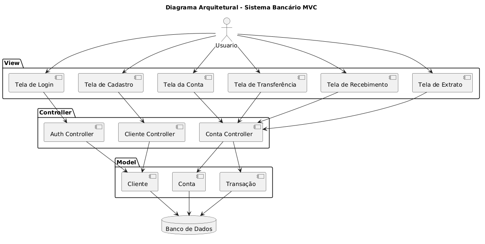

# Sistema Bancário
---
## Integrantes

| Nome | Matrícula |
|---|---|
| Ana Liz Bomfim Gomes | 202302598 |
| Mateus Silva de Sousa | 201802778 |

## Definição

Trabalho acadêmico de um sistema bancário simples, desenvolvido em **Python** com o microframework **Flask**, seguindo o padrão arquitetural **MVC (Model-View-Controller)**. O sistema permite cadastro de clientes, login, consulta de saldo, depósitos, transferências entre contas (via CPF), recebimento e consulta do extrato mensal, com persistência em banco **SQLite** através do **SQLAlchemy**.

## Funcionalidades

- Cadastro de cliente, com criação automática de uma conta associada
- Login e logout com sessão, e senha protegida por hash (Werkzeug)
- Tela inicial (dashboard) com saldo e últimas movimentações
- Transferência entre contas, localizando o destinatário pelo CPF
- Recebimento (simulado)
- Extrato com filtro por mês/ano

## O que é o padrão MVC

MVC divide uma aplicação em três responsabilidades separadas, para que cada parte do código cuide de uma única coisa:

- **Model (Modelo):** representa os dados e as regras de negócio do sistema.
- **View (Visão):** é a camada de apresentação, o que o usuário vê e com o que interage.
- **Controller (Controlador):** é o intermediário — recebe a ação do usuário vinda da View, aciona o Model quando necessário, e decide qual resposta (View) devolver.

O objetivo é que a interface, a lógica de controle e as regras de negócio não fiquem misturadas no mesmo lugar, o que torna o sistema mais organizado, fácil de manter e de testar.

## Diagrama da Arquitetura

## Como o MVC foi aplicado neste projeto

### View — pasta `views/`

São os templates HTML (renderizados com Jinja2, o motor de templates do Flask, estilizados com os arquivos em `static/css/`:

- `login.html` — tela de login
- `cadastrar_cliente.html` — tela de cadastro
- `index.html` — tela da conta / dashboard
- `transferir.html` — tela de transferência
- `receber_pix.html` — tela de recebimento de Pix
- `extrato.html` — tela de extrato
- `sucesso.html` — tela de confirmação, exibida após uma operação concluída

Essas telas correspondem exatamente às caixas no topo do diagrama, dentro do agrupamento **View**. Elas não contêm lógica de negócio: apenas exibem dados recebidos do Controller e capturam as ações do usuário (formulários, cliques), enviando-as de volta via requisições HTTP.

### Controller — pasta `controllers/`

São os *Blueprints* do Flask, responsáveis por receber as requisições HTTP das Views, validar as entradas, acionar o Model e decidir o que devolver ao usuário (renderizar uma View ou redirecionar):

- `auth_controller.py` (`auth_bp`) — login, logout e a rota `home` (tela inicial)
- `cliente_controller.py` (`cliente_bp`) — cadastro de clientes
- `conta_controller.py` (`conta_bp`) — recebimento de Pix, transferência, extrato, depósito e saque

Esses são os três componentes na camada **Controller** do diagrama: *Auth Controller*, *Cliente Controller* e *Conta Controller*. Note que várias telas apontam para o mesmo controller — por exemplo, a Tela da Conta, a Tela de Transferência, a Tela de Recebimento e a Tela de Extrato conversam com o `Conta Controller`, porque todas essas operações giram em torno da conta bancária.

### Model — pasta `models/`

São as classes que representam as tabelas do banco (via SQLAlchemy) e que também concentram as regras de negócio, e não apenas os dados:

- `cliente.py` — classe `Cliente` (nome, CPF, e-mail e senha com hash)
- `conta.py` — classe `Conta` (saldo, número da conta e os métodos `depositar()` e `sacar()`, que validam os valores antes de alterar o saldo)
- `transacao.py` — classe `Transacao` (histórico de cada movimentação: tipo, valor, data e descrição)

Essas são as três caixas na camada **Model** do diagrama: *Cliente*, *Conta* e *Transação*. É importante destacar que a regra "não é possível sacar mais do que o saldo disponível" está dentro do Model (`Conta.sacar`), não no Controller — assim, essa regra vale para qualquer operação que mexa no saldo (saque, transferência, etc.), sem duplicar código.

